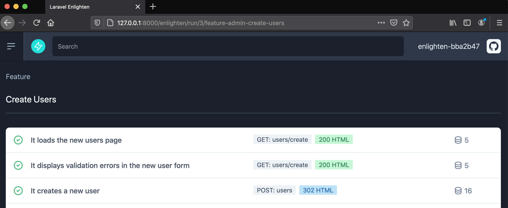

# Enlighten Demo Panel

This is only a demo project, so you can try Laravel Enlighten.

The project is built in Laravel 8 and it's using Enlighten ^0.3.

## Get started

To start, install as a normal Laravel app:

1. Clone the project in your local environment
2. Move to the `enlighten` branch (`git checkout enlighten`)
3. Create 3 databases: `styde_panel`, `styde_panel_tests` and `styde_panel_enlighten`
4. Copy/paste `.env.example` as `.env` in the root directory
5. Configure your database in the `.env` file (the database should be `styde_panel`)
6. Change the `APP_URL` value to point to your project homepage. For example: `APP_URL=http://127.0.0.1:8000`
6. Run `composer install`
7. Run `php artisan key:generate`
8. Run your tests
9. Start the local server with `php artisan serve` if needed
10. Visit `http://127.0.0.1:8000/enlighten` (change the URL if needed).
11. To try the project in the browser, run `php artisan migrate --seed` and go to `/users`
12. After running the tests the first time, run `php artisan enlighten:export` to export your documentation as static files!

Please notice that some tests are failing on purpose, to help you see how Enlighten behaves when one or more tests are failing or incomplete.
